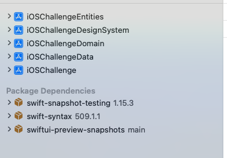
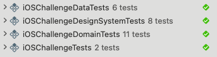

# iOSChallenge

## Description

iOS challenge project, which lists artworks and provide basic information about them and their artists.  

## Getting started

To run this project it's necessary to download the current repository and run the `iOSChallenge.xcworkspace` file, once it's opened, it should download his dependencies, when the download is finished it's necessary to select `iOSChallenge` as the scheme to run and select the device where you want to run it.

### Specifications and dependencies:

- This project has been created in Xcode 15.2
- Run on iOS 17.0 or higher because `SwiftData` only works on this version of iOS or later.
- Uses Swift Package Manager as dependency manager
- [swiftui-preview-snapshots](https://github.com/doordash-oss/swiftui-preview-snapshots) Usign for snapshot testing

### Recomendations:

This project was signed using my own developer team, so as a recommendation if you want to run this project on a fisical device, you should change this developer team and his bundle identifier

## Usage

When you run the app, you will see an empty state, suggesting you pull request to start downloading your first 20 artworks, as you scroll and get closer to the last artwork downloaded, the app should download the next 20 artworks and so on. All downloaded artworks will be stored locally, so the next time you open the app you will see the previous list of artworks.

When you select one of your artworks you will be redirected to the next page where you can find some information about this art and his artist

If you want to restart your downloaded artworks just pull refresh and this action will restart your artworks to first 20

Important: For developer use only, a trash button has been added to delete all saved artworks and restart your app to its initial state

## Achitecture

- This project is implemented using Clean Architecture as architecture pattern.
- Each clean architecture layer has its own framework
- Data layer uses SwiftData as local database
- The domain layer has all the use cases
- Factory patter is used to facilite dependency injection
- MVVM architecture is implement for any feature needed
- The router pattern may be a little unnecessary in this project but I wanted to add it to indicate the ease it gives us when wanting to navigate between views 

## Design system

A design system was created for the unification of all the UI elements.
- Custom fonts were downloaded from [www.fontspace.com](https://www.fontspace.com/sans-andreas-font-f90635)

## Testing
- Each framework has its own unit testing, so any framework must to be tested individually
- For snapshot testing we use swiftui-preview-snapshots dependency, and each screenshot was saved under `iOSChallenge/iOSChallengeTests/__Snapshots__/<ViewTest>`, if you delete any of them, the test will fail but a new screenshot will be taken

